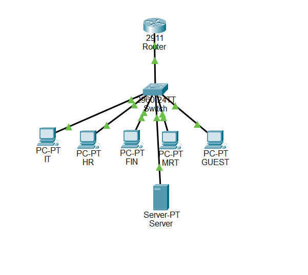
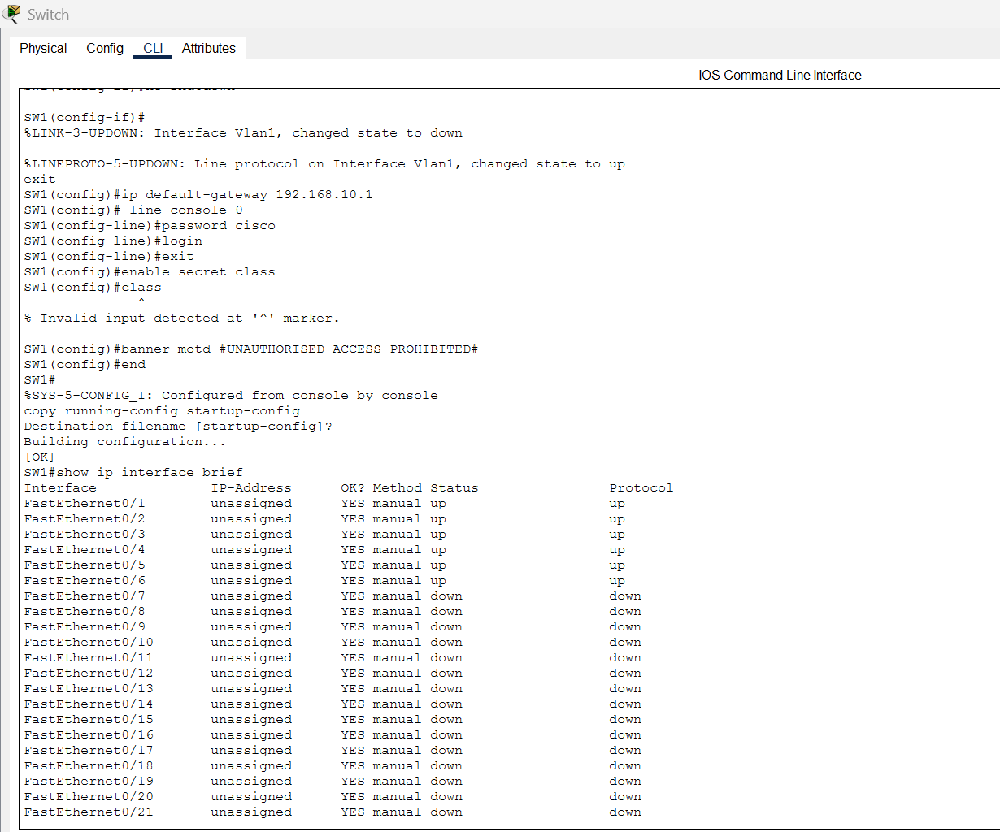

# Cisco Packet Tracer — Basic LAN & DHCP

## 📌 Project Overview

This project demonstrates the design, configuration, and testing of a small business Local Area Network (LAN) using Cisco Packet Tracer.

The lab includes a Cisco 2911 router, Cisco 2960 switch, six client PCs, and a server. The router provides DHCP services to automatically assign IP addresses to client devices.

The project was created as part of my hands-on networking and IT support home lab practice.

---

## 🖥️ Network Topology

The network consists of:

* 1 × Cisco 2911 Router
* 1 × Cisco 2960 Switch
* 6 × Client PCs
* 1 × Server
* Copper straight-through Ethernet connections

### Network Structure

```text
                    R1
              Cisco 2911 Router
               192.168.10.1
                     |
                     |
                  SW1
              Cisco 2960
                     |
        +------------+------------+
        |      |      |      |     |
       PC1    PC2    PC3    PC4   PC5
                                      |
                                     PC6
                                      |
                                   Server
                              192.168.10.10
```

---

## 🌐 IP Addressing

| Device  | IP Address    | Assignment |
| ------- | ------------- | ---------- |
| R1      | 192.168.10.1  | Static     |
| SW1     | 192.168.10.2  | Static     |
| Server  | 192.168.10.10 | Static     |
| PC1–PC6 | 192.168.10.x  | DHCP       |

**Network:** `192.168.10.0/24`

**Default Gateway:** `192.168.10.1`

**DNS:** `8.8.8.8`

---

## ⚙️ Configuration Performed

### Router

Configured:

* Hostname: `R1`
* GigabitEthernet 0/0
* IP address `192.168.10.1/24`
* DHCP service
* Default gateway
* DNS server
* DHCP address exclusions

Example DHCP configuration:

```text
ip dhcp excluded-address 192.168.10.1 192.168.10.20

ip dhcp pool LAN
 network 192.168.10.0 255.255.255.0
 default-router 192.168.10.1
 dns-server 8.8.8.8
```

### Switch

Configured:

* Hostname: `SW1`
* VLAN 1 management IP: `192.168.10.2`
* Default gateway: `192.168.10.1`
* Console password
* Enable secret
* MOTD banner

---

## 🧪 Testing & Verification

Network connectivity was verified using Cisco IOS and PC command-line tools.

### Router Interface Verification

```text
show ip interface brief
```

### DHCP Verification

```text
show ip dhcp binding
```

### Switch MAC Address Table

```text
show mac address-table
```

### Switch Port Status

```text
show interfaces status
```

### Client IP Configuration

```text
ipconfig
```

### Connectivity Testing

```text
ping 192.168.10.1
ping 192.168.10.10
```

Successful ping responses confirmed connectivity between the clients, router, switch, and server.

---

## 📸 Screenshots

### Network Topology



### Router Configuration


### DHCP Bindings


### Connectivity Test


### Switch MAC Address Table



---

## 🛠️ Skills Demonstrated

* Cisco Packet Tracer
* Basic Cisco IOS
* IPv4 addressing
* Subnetting fundamentals
* DHCP configuration
* Static IP configuration
* LAN design
* Router configuration
* Cisco switch configuration
* VLAN 1 management
* MAC address table analysis
* Network connectivity testing
* Ping and IP troubleshooting
* Basic network troubleshooting

---

## 🔍 Troubleshooting Approach

A basic troubleshooting methodology was used:

```text
Check physical connection
        ↓
Check IP configuration
        ↓
Test default gateway
        ↓
Test server/client connectivity
        ↓
Check switch port status
        ↓
Check MAC address table
        ↓
Check router/switch configuration
```

This approach mirrors common first-line network troubleshooting practices used in IT support environments.

---

## 🚀 Future Improvements

Future labs will expand this network with:

* VLAN segmentation
* Inter-VLAN routing
* Trunking
* Multiple DHCP scopes
* DNS services
* Static routing
* Network security
* Access Control Lists (ACLs)
* Wireless networking
* Network troubleshooting scenarios

---

## 📁 Project File

The Cisco Packet Tracer project file is included:

`LAB-01-Basic-LAN-DHCP.pkt`

Open the file with Cisco Packet Tracer to inspect the topology and configurations.

---

## 🎓 Purpose

This project is part of my ongoing hands-on networking home lab portfolio, designed to strengthen practical skills for IT Support, Service Desk, Desktop Support, and Network Support roles.
